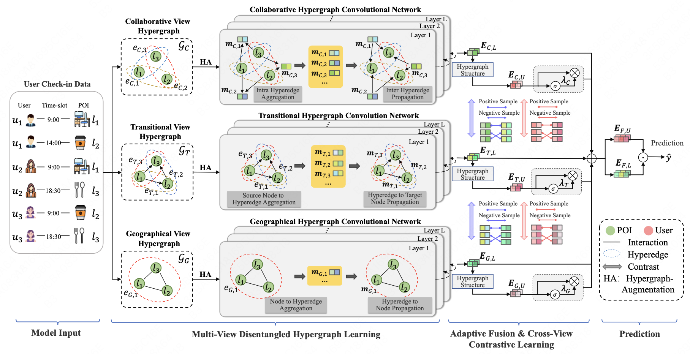

# SIGIR2024_DCHL

The official PyTorch implementation for our SIGIR'24 full paper [Disentangled Contrastive Hypergraph Learning for Next POI Recommendation](https://www.researchgate.net/profile/Yantong_Lai2/publication/382203855_Disentangled_Contrastive_Hypergraph_Learning_for_Next_POI_Recommendation/links/66a3557a4433ad480e7b47ca/Disentangled-Contrastive-Hypergraph-Learning-for-Next-POI-Recommendation.pdf), which is accepted to SIGIR'2024 as full paper for oral presentation in Washington, U.S.

If you have any questions, please feel free to issue or contact me by email. If you use our codes and datasets in your research, please cite:
```
@inproceedings{lai2024disentangled,
  title={Disentangled Contrastive Hypergraph Learning for Next POI Recommendation},
  author={Lai, Yantong and Su, Yijun and Wei, Lingwei and He, Tianqi and Wang, Haitao and Chen, Gaode and Zha, Daren and Liu, Qiang and Wang, Xingxing},
  booktitle={Proceedings of the 47th International ACM SIGIR Conference on Research and Development in Information Retrieval},
  pages={1452--1462},
  year={2024}
}
```


## Overview
Next point-of-interest (POI) recommendation has been a prominent and trending task to provide next suitable POI suggestions for users. Most existing sequential-based and graph neural network-based methods have explored various approaches to modeling user visiting behaviors and have achieved considerable performances. However, two key issues have received less attention: i) Most previous studies have ignored the fact that user preferences are diverse and constantly changing in terms of various aspects, leading to entangled and suboptimal user representations. ii) Many existing methods have inadequately modeled the crucial cooperative associations between different aspects, hindering the ability to capture complementary recommendation effects during the learning process. To tackle these challenges, we propose a novel framework Disentangled Contrastive Hypergraph Learning (DCHL) for next POI recommendation. Specifically, we design a multi-view disentangled hypergraph learning component to disentangle intrinsic aspects among collaborative, transitional and geographical views with adjusted hypergraph convolutional networks. Additionally, we propose an adaptive fusion method to integrate multi-view information automatically. Finally, cross-view contrastive learning is employed to capture cooperative associations among views and reinforce the quality of user and POI representations based on self-discrimination. Extensive experiments on three real-world datasets validate the superiority of our proposal over various state-of-the-arts.




## Running
```
python3 run.py --dataset NYC
python3 run.py --dataset TKY
```


## License
```
MIT License

Copyright (c) 2024 Yantong Lai

Permission is hereby granted, free of charge, to any person obtaining a copy
of this software and associated documentation files (the "Software"), to deal
in the Software without restriction, including without limitation the rights
to use, copy, modify, merge, publish, distribute, sublicense, and/or sell
copies of the Software, and to permit persons to whom the Software is
furnished to do so, subject to the following conditions:

The above copyright notice and this permission notice shall be included in all
copies or substantial portions of the Software.

THE SOFTWARE IS PROVIDED "AS IS", WITHOUT WARRANTY OF ANY KIND, EXPRESS OR
IMPLIED, INCLUDING BUT NOT LIMITED TO THE WARRANTIES OF MERCHANTABILITY,
FITNESS FOR A PARTICULAR PURPOSE AND NONINFRINGEMENT. IN NO EVENT SHALL THE
AUTHORS OR COPYRIGHT HOLDERS BE LIABLE FOR ANY CLAIM, DAMAGES OR OTHER
LIABILITY, WHETHER IN AN ACTION OF CONTRACT, TORT OR OTHERWISE, ARISING FROM,
OUT OF OR IN CONNECTION WITH THE SOFTWARE OR THE USE OR OTHER DEALINGS IN THE
SOFTWARE.
```

